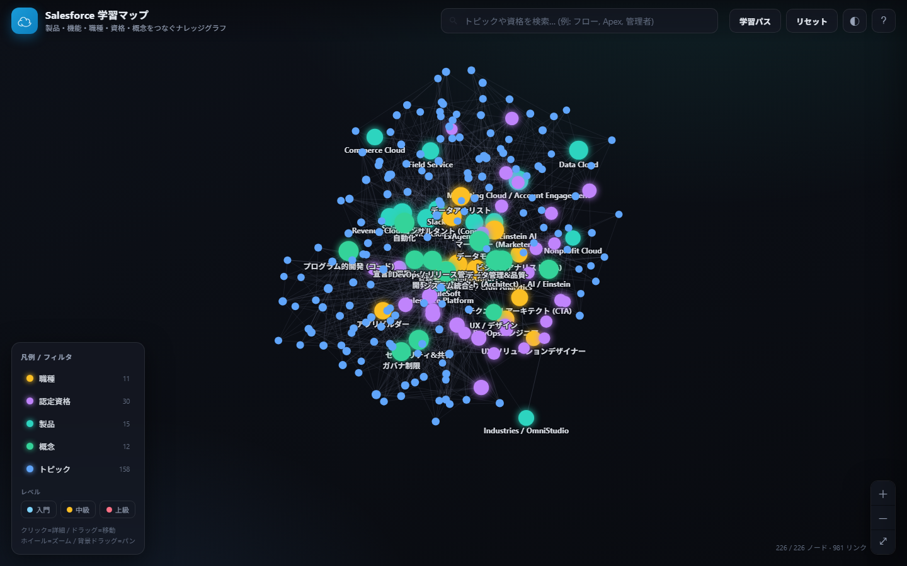

# ☁︎ Salesforce 学習マップ

Salesforce を **何から学べばいいか一目でわかる**、Obsidian 風のインタラクティブ・ナレッジグラフです。
製品・機能・職種・認定資格・概念を属性で結び、学習ルートを可視化します。

**🔗 公開サイト（2D）:** https://akira-kataoka.github.io/salesforce-learning-map/
**🪐 3D 版（Three.js）:** https://akira-kataoka.github.io/salesforce-learning-map/graph3d.html



## 特徴

- **348 ノード / 1667 リンク** — 製品 (22)・職種 (11)・認定資格 (35)・概念 (14)・学習トピック (266)
- **2D 版**：Canvas 製フォースグラフ（依存ライブラリなし・完全自己完結）
- **3D 版**：Three.js による立体ナレッジグラフ（グロウ表現・自動回転・軌道操作）
- **包含関係の可視化** — リンクを種別で描き分け:**包含**(製品・資格が機能/トピックを含む=グループ)を表す色付き実線、**前提**(学習の順序)を表す矢印付き破線、**関連・分類**を表す淡い線。<br>「**製品・資格 = グループ、トピック = 最小単位**」の階層を表現。
- **詳細パネル** — 各ノードに「概要 / なぜ学ぶか / 前提知識 / 学習ステップ / 主要トピック / つまずきポイント / おすすめリソース」を収録し、包含関係で整理した関連ノードを提示
- **参考ページ** — 各ノードから Trailhead・公式ヘルプ・開発者ドキュメントへ直接リンク
- **フィルタ / 検索** — 種別・レベルでの絞り込み、キーワード検索
- **ダーク / ライト テーマ**対応・レスポンシブ

## 使い方

1. まず **職種（オレンジ）** を選び、つながる **認定資格（紫）** → **トピック（青）** をたどると学習ルートが見えます
2. ノードを**クリック**すると右側に詳細と関連ノードが開きます
3. 上部の**検索**で項目を探し、凡例の**チップ**で種別・レベルを絞り込めます
4. 「**学習パス**」ボタンでハブ（製品・職種・資格・概念）だけの俯瞰図に切り替わります

## 構成

```
index.html          2D 版エントリ
graph3d.html        3D 版エントリ（Three.js）
css/style.css       共通スタイル（ダーク/ライト）
js/graph.js         2D フォースシミュレーション + Canvas 描画
js/app.js           2D UI・詳細パネル・Markdown 描画
js/sfmap-core.js    2D/3D 共通のデータ構築・詳細パネル生成
js/app3d.js         3D シーン・3D フォースレイアウト・ブルーム・操作
js/vendor/          Three.js r128 一式（ローカル同梱）
data/anchors.js     製品/職種/資格/概念（ハブ=グループ）のデータ
data/topics.js      学習トピック 266 件（Fable 5 生成・最小単位）
```

## クレジット

コンテンツは Salesforce エコシステムの一般公開情報に基づく学習ガイドです。
Salesforce, Trailhead, Agentforce, Einstein 等は Salesforce, Inc. の商標です（本サイトは非公式）。

🤖 Claude Code (Opus 4.8) + Fable 5 で作成。
